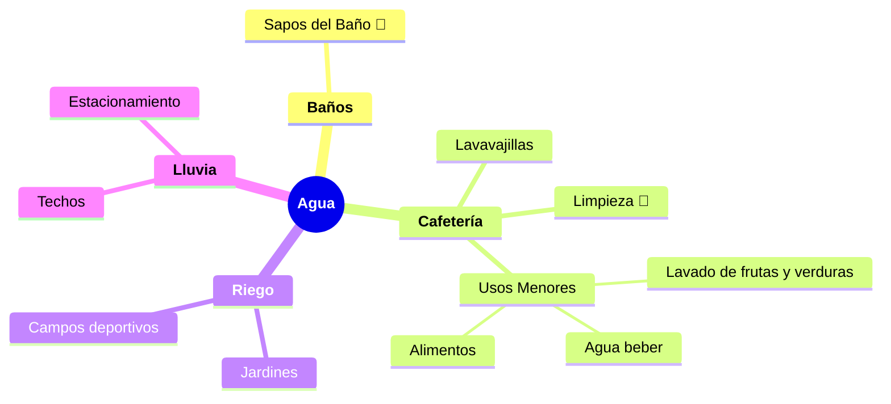

## Design Thinking

!!! tip "Tarea 1"
    1.	Revisa de manera individual el artículo “Solución de problemas de producción en una empresa manufacturera de calzado en León Guanajuato, México” 
    2.  Problema: "Reducción del desperdicio de agua en instalaciones universitarias"
    Hacer un mapa mental
    Identificar etapas del design thinking

<!---

### Revisa de manera individual el artículo “Solución de problemas de producción en una empresa manufacturera de calzado en León Guanajuato, México” 

| Etapas del método científico | Descripción |
|-----------:|:-----:|
| **Definición del Problema**   | 2     |
| MCU Y      | 1     |

--->

### Método científico

Revisar de manera individual el artículo “Solución de problemas de producción en una empresa manufacturera de calzado en León Guanajuato, México”

[Descargar el Documento (PDF)](./recursos/archivos/tarea_2_S1.pdf)

<iframe src="../recursos/archivos/tarea_2_S1.pdf" width="800" height="440"></iframe>

### Problema: "Reducción del desperdicio de agua en instalaciones universitarias"
    Hacer un mapa mental
    Identificar etapas del design thinking

Lo primero que hice fue acudir con las autoridades de **Campus Sustentable** las cuales, después de una entrevista en profundidad, **Negaron que exista un problema de desperdicio de agua en la Universidad**. Yo comparto este punto de vista dados los sistemas con que contamos como la recolección del agua de lluvia del IDIT, el uso de aguas grises para regar los campos deportivos, el uso de mingitorios sin agua, etc. 

Presuponemos una universidad donde exista desperdicio de agua

Cada uno de las ramas del mapa mental indican potenciales fuentes de pérdida de agua

``` mermaid

mindmap
  root((**Agua**))
    **Baños**
        Sapos del Baño 🐸
    **Cafetería**
        Lavavajillas
        Limpieza 🧹
        Usos Menores
            Lavado de frutas y verduras
            Agua beber
            Alimentos
    **Riego**
      Jardines
      Campos deportivos
    **Lluvia**
        Techos
        Estacionamiento

```
* Design thinking

Tabla con fases de design thinking para el problema del desperdicio del agua en una universidad

